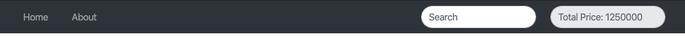
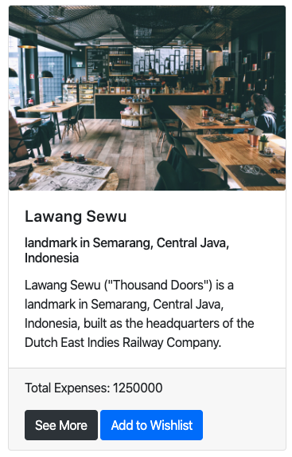

# Web Apps Project 1 // Travel Guide Website

## Projects Concepts

### Approaching a Project

Developing a large project is hard. Don't just dive in and try to tackle the entire thing all at once. As the famous saying goes:

A goal without a plan is just a wish.

Start with a plan! Here are some steps that I like to follow when building a project:

* outline the steps needed to build the project
* draw the application
  * what individual page would look like
  * how the page are connected to each other
* write down the pseudocode
* develop the page piece by piece

And just before submitting:

* squash all bugs
* check the rubric and make sure that your project meets all requirements

Take it slow and practice your newly acquired skills. You've got this! 🙌🏼

If you get stuck, take advantage of your mentorship services.

### Project Overview

In the _Travel Guide Website_ project, you'll create a landing page that allows you to view all destinations/place or by its city and select destination you want to see the detail price/expenses of accommodation. The project emphasizes using HTML to build the webpage, CSS to style the webpage, Javascript and DOM to view destination by city and to calculate the price of accommodation.

#### Get the Project

You have a few options to start developing this project:

* forking and cloning the start repository
* starting from scratch with make your own file

#### Starter Code

If you'd like to work locally on your own computer, fork and clone the starter repository.

The code in the starter repo contains all the CSS and HTML markup that may be used but omits the JS code that is required to complete the project. This can save you some time if you don't wish to write all the CSS and HTML from scratch. The provided code will demonstrate a static HTML page of the finished application, but with no interactive functionality.

#### Starting from Scratch

If you'd like to start completely from scratch, you can make your own index.html file and all of the CSS and Javascript files you need.

#### App Functionality

In this application, the main page displays a list of all destinations \(i.e. Kota Tua, Bandungan, etc\), each of which contains a city to group. The destination must contains:

* Destination Title
* Description
* Destination Image
* Location
* Expenses

The homepage of the Travel Guide shows the title and then all the list of destinations also the city drop down button to filter. You can also add the search input to search destinations quickly. The static home page \(and your completed app\) should look something like this.

Each destination has a control that lets you select the destination to calculate for expenses. When you select a different destinations, the expenses will sum with previous destination and calculate the final estimated price. Note that the default value for the total price should always be zero if there is no destination selected.

The detail page should launch a modal box to show the detail such as Destination Title, Description, Destination Image, Location, Expenses, and the "Add to Wishlist" button to calculate the expenses and close button to navigate to home page.

The main page also has a search form that allows you to find destinations to add to your Wishlist.

The search form has a text input that may be used to find destination quickly. As the value of the text input changes, the destinations that match that query are displayed on the page, along with a control that lets you add the destination to your Go.

When you navigate back to the main page from the destination detail modal, you should instantly see all of the destination you listed before.

#### Submission Requirements

Your submission should include all of the files necessary to launch your web application on a browser. You can assume that your reviewer will have browser installed on their machine.

#### Considerations

The focus of this project is on writing functional HTML, CSS, and JS code, not on making the page beautiful. Feel free to spend some time working on your layout and CSS if you want to, but the goal for this project is correct functionality.

### Project Instructions & Rubric

#### How will this project be evaluated

Your project will be evaluated by a Hacktiv8 Online Programs Code Reviewer according to the rubric. Be sure to review it thoroughly before you submit. All criteria must "meet specifications" in order to pass. You are not suggested to use any library outside of what we've learned in this Online Programs.

The project rubric is your source of truth while building this project. Save it to your browser bookmarks so you can access it easily!

#### Submission Instructions

If you choose to develop on your local machine you will need to:

Upload your zip file to Hacktiv8 Online Program Projects submissions.

### User Story

User Story is a description of an application’s functionality. In order to complete this project, you have to build an apps that cover all the functionality from the user story below.

**User Story \# 1** - My Travel Guide should have a navbar with an id of `navbar`.

**User Story \# 2** - The navbar should contain search bar and element that hold total expenses. The navbar should always be at the top of the viewport.

**User Story \# 3** - The welcome section should have an `h1` element that contains text of website title.

**User Story \# 4** - My Travel Guide should have a projects section using card deck with `class="card-deck"`.

**User Story \# 5** - Each destination displayed using card. Card Body should contain Destination Title in `card-title` and Destination Description in `card-text`. In `card-footer` section should contain Total Expenses, Detail Button, and Wishlist Button.

**User Story \# 6** - When clicking the see more button, My Travel Guide should launch a modal box contain Destination Title, Description, Destination Image, Location, Expenses, and the "Add to Wishlist" button.

**User Story \# 7** - When clicking add to wishlist button, my travel guide should calculate total expenses in the total price element at `navbar`.

**User Story \# 8** - My Travel Guide should display the correct destination when typing specific destination in the search form.

**User Story \# 9** - My Travel Guide should display your personal bio in the about page. Your personal bio should have your image, short description of your bio, table containing your education or work experience. And contact us form.

**User Story \# 10** - In about page, contact us forms should have email, name, and message text input. Add form validation for you contact page such as: all forms must be filled out, email forms should have email format and message text input should have less then 200 character.

### Projects Submission

#### Project Submission Checklist

Before submitting your project, please review and confirm the following items.

* I am confident all rubric items have been met and my project will pass as submitted. \(If not, I will discuss with my mentor prior to submitting.\)
* Project builds correctly without errors and runs.
* All required functionality exists and my project behaves as expected per the project's specifications.

Once you have checked all these items, you are ready to submit!

### Project Rubric

| Application Setup |  |
| :--- | :--- |
| CRITERIA | SPECIFICATIONS |
| Is the application easy to manage? | The application was created with separate css and js inside of each folder and index.html as an entry point for the website |
| Does the application include README with clear installation and launch instructions? | An updated README that describes the project and has instructions for managing and modifying the project is included. |

| Main Page |  |
| :--- | :--- |
| CRITERIA | SPECIFICATIONS |
| Does the main page show list of destinations? | The main page shows list of all destinations. Each destination is showing the correct content, along with its title and add to go button. |
| Does the main page allow users to navigate between destinations? | The main page shows a control that allows users to navigate between destinations. The control should be tied to each destination instance. The functionality of navigating to each destination works correctly. |
| Does the main page responsive? | The main page adjust its layout based on screen resolution and breakpoints provided in css works properly. |
| Does the main page code is clean? | The main page html code tabulation based on its tag. No inline css and \(external css and js only\). |
| Does the main page css code is optimised? | No redundant styling code. |

| Code Functionality |  |
| :--- | :--- |
| CRITERIA | SPECIFICATIONS |
| Does the project code handle the search function appropriately? | Everytime user type on search form, destination that match the criteria shown on homepage. |
| Does the project code handle the add to wishlist function properly? | When user click the add to wishlist button, price of the destination expenses added to expenses column. |
| Does the total of destination expenses correct? | total destination expenses are sum of every destination added with add to wishlist button. |
| Does the destination details show the correct content? | Destination detail page contain Destination Title, Description, Destination Image, Location, Expenses, and the "add to wishlist" button. |
| Does the code run without errors? | The code runs without errors. There are no warnings that resulted from not following the best practices listed in the documentation. All code is functional and formatted properly. |

| Skillset Checklist |
| :--- |
| CRITERIA |
| Able to write HTML Tags |
| Able to write Css Syntax |
| Able to do basic conditionals |
| Able to do basic loops |
| Able to do basic DOM Manipulation |
