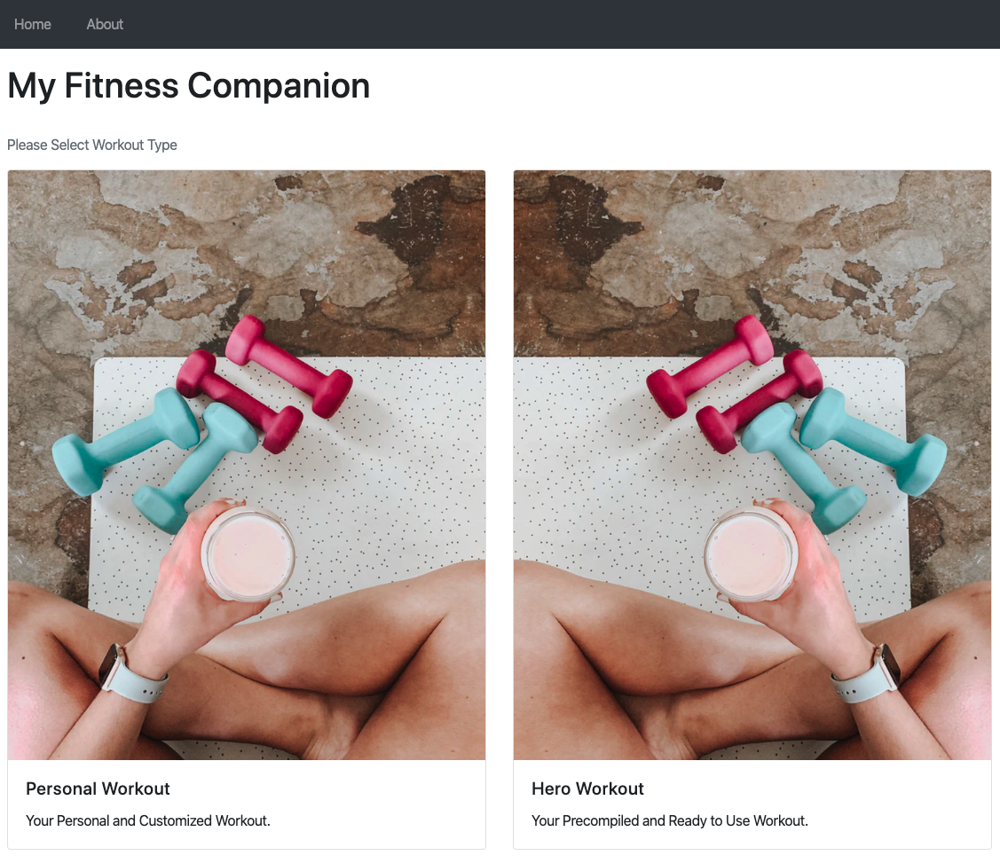
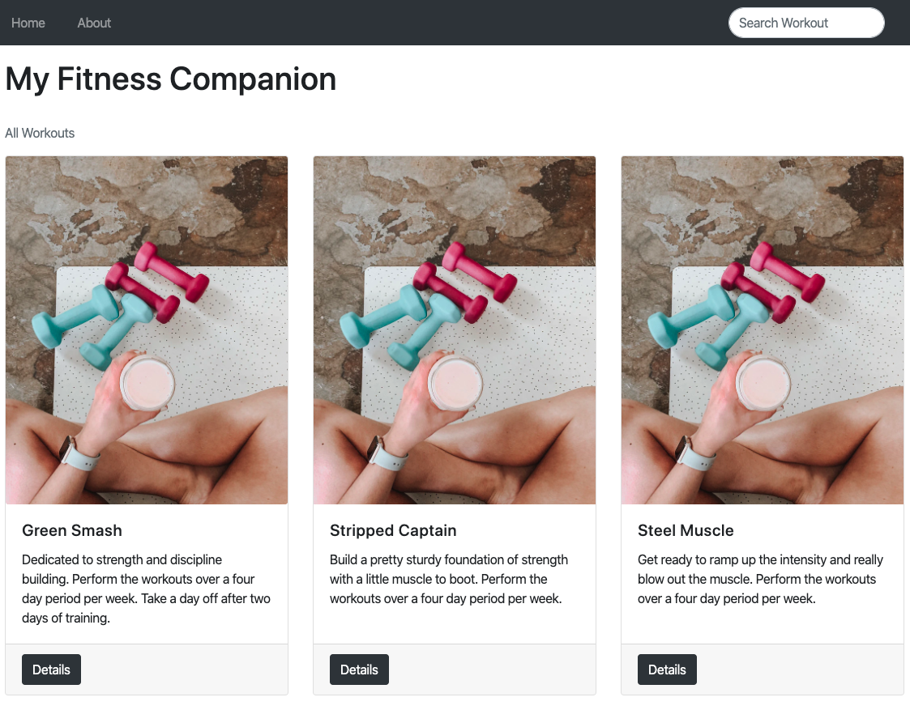
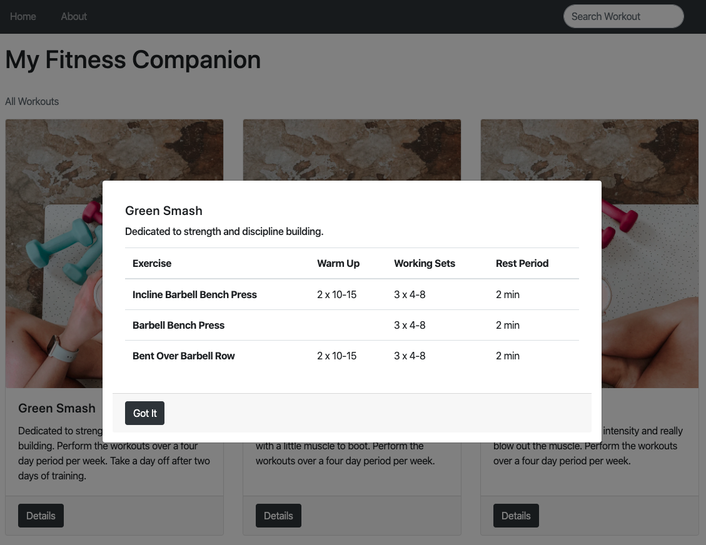

# Web Apps Project 3 // Fitness Companion Apps

## Projects Concepts

### Approaching a Project

Developing a large project is hard. Don't just dive in and try to tackle the entire thing all at once. As the famous saying goes:

A goal without a plan is just a wish.

Start with a plan! Here are some steps that I like to follow when building a project:

* outline the steps needed to build the project
* draw the application
  * what individual page would look like
  * how the page are connected to each other
* write down the pseudocode
* develop the page piece by piece

And just before submitting:

* squash all bugs
* check the rubric and make sure that your project meets all requirements

Take it slow and practice your newly acquired skills. You've got this! 🙌🏼

If you get stuck, take advantage of your mentorship services.

### Project Overview

In the _Fitness Companion_ _Apps_ project, you'll create an app that allows you manage/set your daily workout and give you suggestion from list of all workout template available. The project emphasizes using Vue to maintain the front-end and Express to maintain the backend of the apps.

#### Get the Project

You have a few options to start developing this project:

* forking and cloning the start repository
* starting from scratch with make your own file

#### Starter Code

If you'd like to work locally on your own computer, fork and clone the starter repository.

The code in the starter repo contains all the CSS and HTML markup that may be used but omits the Vue and Node code that is required to complete the project. This can save you some time if you don't wish to write all the CSS and HTML from scratch. The provided code will demonstrate a static HTML page of the finished application, but with no interactive functionality.

#### Starting from Scratch

If you'd like to start completely from scratch, you can make your own files you need.

#### App Functionality

In this application, the main page displays 2 button/link to navigate between Personal Workout and Precompiled Workout. Personal Workout is an own workout set by user whatever they want. Precompiled Workout are list of precompiled workout named by superhero \(eg. Batman Workout contains: 20 squats, 40 punches, etc\)

When user navigate to Personal Workout, user should see input and add button to add their personal workout. User receiving a list of personal workout added along with a checkbox in each workout to mark whether its done or not.

When user navigate to Hero Workout, user should see list of precompiled workout from json containing images and title of workout. User could click detail button to view the detail of workout such as title and list of moves.

The hero page also has a search form that allows you to find hero workout to see the details.

The search form has a text input that may be used to filter hero workout quickly. As the value of the text input changes, the hero workout that match that query are displayed on the page, along with a control that lets you view the detail of workout.

#### Submission Requirements

Your submission should include all of the files necessary to launch your web application on a browser. You can assume that your reviewer will have browser installed on their machine.

#### Considerations

The focus of this project is on writing functional Vue and Node code, not on making the page beautiful. Feel free to spend some time working on your layout and CSS if you want to, but the goal for this project is correct functionality.

### Project Instructions & Rubric

#### How will this project be evaluated

Your project will be evaluated by a KODEgree Code Reviewer according to the rubric. Be sure to review it thoroughly before you submit. All criteria must "meet specifications" in order to pass.

The project rubric is your source of truth while building this project. Save it to your browser bookmarks so you can access it easily!

#### Submission Instructions

If you choose to develop on your local machine you will need to:

Upload your zip file to Hacktiv8 Online Program Projects submissions.

### User Story

User Story is a description of an application’s functionality. In order to complete this project, you have to build an apps that cover all the functionality from the user story below.

**User Story \# 1** - My Fitness Companion should have a navbar with an id of `navbar`.

**User Story \# 2** - The navbar should always be at the top of the viewport.

**User Story \# 3** - ****The welcome section should have an `h1` element that contains text of website title. Welcome section also should have two buttons for personal or precompiled workout.

**User Story \# 4** - ****My Fitness Companion precompiled workout section should have a workout section using card deck with `class="card-deck"`. You should fetch the precompiled workout data from JSON file.

**User Story \# 5** - ****Each precompiled workout displayed using card. Card Body should contain workout title in `card-title` and workout description in `card-text` which all the data should be fetched from JSON file. In `card-footer` section should contain detail button.

**User Story \# 6** - When clicking the detail button, My Fitness Companion should launch a modal box contain workout title, short workout description and exercise data from JSON file.

**User Story \# 7** - My Fitness Companion should display the correct destination when typing specific destination in the search form in precompiled workout section.

**User Story \# 8** - In personal workout section, My Fitness Companion should have workout type input element with id of `addWorkout` and clickable element with id of `addButton` to submit workout type.

**User Story \# 9** - In personal workout section, My Fitness Companion should have workout list section with id of `workoutList`.

**User Story \# 10** - When I click the element with id of `addButton`, the value within id of `addWorkout` should displayed in workout list section of id `workoutList`. New list of workout in workout list should have id of `toDo1`.

**User Story \# 11** - When I already have Workout in my workout list section, a new workout added should be on top of the old workout with new increment id based on last id.

**User Story \# 12** - Each workout displayed in workoutList id should have checkbox.

**User Story \# 13** - When i click the checkbox, workout within that checkbox should disappear and workout below should go up.

### Projects Submission

#### Instructions

Please verify that your project adheres to our HTML, CSS, JavaScript, and Git style guidelines.

If you chose to develop on your local machine you will need to:

* Push your project to GitHub, making sure to push the master branch.
* On the project submission page choose the option "Submit with GitHub"
* Select the repository for this project \(you may need to connect your GitHub account first\).

#### Project Submission Checklist

Before submitting your project, please review and confirm the following items.

* I am confident all rubric items have been met and my project will pass as submitted. \(If not, I will discuss with my mentor prior to submitting.\)
* Project builds correctly without errors and runs.
* All required functionality exists and my project behaves as expected per the project's specifications.

Once you have checked all these items, you are ready to submit!

### Project Rubric

| Application Setup |  |
| :--- | :--- |
| CRITERIA | SPECIFICATIONS |
| Is the application easy to manage? | The application was created with separate css and js inside of each folder and index.html as an entry point for the website |
| Does the application include README with clear installation and launch instructions? | An updated README that describes the project and has instructions for managing and modifying the project is included. |

| Personal Workout Page |  |
| :--- | :--- |
| CRITERIA | SPECIFICATIONS |
| Does personal workout page display form input? | Personal workout page displays form, in a shape of workout input and add button |

| Precompiled Workout Page |  |
| :--- | :--- |
| CRITERIA | SPECIFICATIONS |
| Does the precompiled page show list of precompiled workout? | The precompiled page shows list of all workout. Each destination is showing the correct content, along with its title and detail button. |
| Does precompiled page have search bar? | Yes, it does. It is positioned in the navigation bar, at the top of the page. |

| Code Functionality |  |
| :--- | :--- |
| CRITERIA | SPECIFICATIONS |
| Does search function work? | The search function in a search bar works when a user type any character in the search bar. At the same time, it filters workout based on the input. |
| Does the detail button in precompiled workout works? | It will work when there is an interaction that display a modal, which is filled with detail from precompiled workout. |
| Does add workout function in personal workout works? | User can put types of workout in the input form. Once they press add, there will be a new value based on the input. |
| Does checkbox function in personal workout work? | User can interract with checkbox in every workout on the personal workout page. Once the checkbox is ticked, the font will become strikethrough |
| Does navigation page work? | User can navigate from the main page to personal or precompiled page without problems. The process can also be done in reverse. |
| Does the code run without errors? | The code runs without errors. There are no warnings that resulted from not following the best practices listed in the documentation. All code is functional and formatted properly. |
