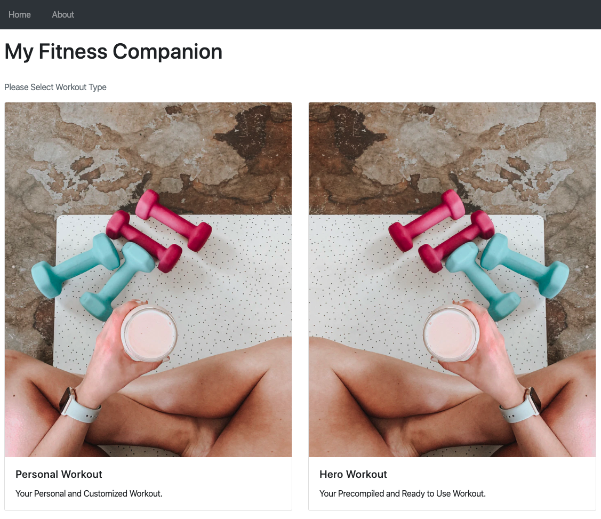

# FSD 3 // Fitness Companion Apps

## Projects Concepts

### Approaching a Project

Developing a large project is hard. Don't just dive in and try to tackle the entire thing all at once. As the famous saying goes:

A goal without a plan is just a wish.

Start with a plan! Here are some steps that I like to follow when building a project:

* outline the steps needed to build the project
* draw the application
  * what individual page would look like
  * how the page are connected to each other
* write down the pseudocode
* develop the page piece by piece

And just before submitting:

* squash all bugs
* check the rubric and make sure that your project meets all requirements

Take it slow and practice your newly acquired skills. You've got this! 🙌🏼

If you get stuck, take advantage of your mentorship services.

### Project Overview

In the _Fitness Apps_ project, you'll create an app that allows you manage/set your daily workout and give you suggestion from list of all workout template available. The project emphasizes using Vue to maintain the front-end and Express to maintain the backend of the apps.

#### Get the Project

You have a few options to start developing this project:

* forking and cloning the start repository
* starting from scratch with make your own file

#### Starter Code

If you'd like to work locally on your own computer, fork and clone the starter repository.

The code in the starter repo contains all the CSS and HTML markup that may be used but omits the Vue and Node code that is required to complete the project. This can save you some time if you don't wish to write all the CSS and HTML from scratch. The provided code will demonstrate a static HTML page of the finished application, but with no interactive functionality.

#### Starting from Scratch

If you'd like to start completely from scratch, you can make your own files you need.

#### App Functionality

In this application, the main page displays 2 button/link to navigate between Personal Workout and Hero Workout. Personal Workout is an own workout set by user whatever they want. Hero Workout are list of precompiled workout named by superhero \(eg. Batman Workout contains: 20 squats, 40 punches, etc\)

When user navigate to Personal Workout, user should see input and add button to add their personal workout. User receiving a list of personal workout added along with a checkbox in each workout to mark whether its done or not.

When user navigate to Hero Workout, user should see list of precompiled workout from json containing images and title of workout. User could click detail button to view the detail of workout such as title and list of moves.

The hero page also has a search form that allows you to find hero workout to see the details.

The search form has a text input that may be used to filter hero workout quickly. As the value of the text input changes, the hero workout that match that query are displayed on the page, along with a control that lets you view the detail of workout.

#### Submission Requirements

Your submission should include all of the files necessary to launch your web application on a browser. You can assume that your reviewer will have browser installed on their machine.

#### Considerations

The focus of this project is on writing functional Vue and Node code, not on making the page beautiful. Feel free to spend some time working on your layout and CSS if you want to, but the goal for this project is correct functionality.

### Project Instructions & Rubric

#### Before Submitting

Make sure your code adheres to our HTML, CSS, JavaScript, and Git style guidelines.

* KODEgree's HTML Style Guide
* KODEgree's CSS Style Guide
* KODEgree's JavaScript Style Guide
* KODEgree's Git Style Guide

We recommend using Git from the very beginning. Make sure to commit often and to use well-formatted commit messages that conform to our guidelines.

#### How will this project be evaluated

Your project will be evaluated by a KODEgree Code Reviewer according to the rubric. Be sure to review it thoroughly before you submit. All criteria must "meet specifications" in order to pass.

The project rubric is your source of truth while building this project. Save it to your browser bookmarks so you can access it easily!

#### Submission Instructions

If you choose to develop on your local machine you will need to:

Push your project to GitHub, making sure to push the master branch. On the project submission page choose the option "Submit with GitHub" Select the repository for this project \(you may need to connect your GitHub account first\).

### User Story

**User Story \# 1** - My Fitness Companion should have a navbar with an id of `navbar`.

**User Story \# 2** - The navbar should always be at the top of the viewport.

**User Story \# 3** - ****The welcome section should have an `h1` element that contains text of website title. Welcome section also should have two buttons for personal or precompiled workout.

**User Story \# 4** - ****My Fitness Companion precompiled workout section should have a workout section using card deck with `class="card-deck"`.

**User Story \# 5** - ****Each precompiled workout displayed using card. Card Body should contain workout title in `card-title` and workout description in `card-text`. In `card-footer` section should contain detail button.

**User Story \# 6** - When clicking the detail button, My Fitness Companion should launch a modal box contain workout title, short workout description and exercise.

**User Story \# 7** - In personal workout section, when clicking add button, My Fitness Companion should add user's personal exercise.

**User Story \# 8** - My Fitness Companion should display the correct destination when typing specific destination in the search form in precompiled workout section.

### Projects Submission

#### Instructions

Please verify that your project adheres to our HTML, CSS, JavaScript, and Git style guidelines.

If you chose to develop on your local machine you will need to:

* Push your project to GitHub, making sure to push the master branch.
* On the project submission page choose the option "Submit with GitHub"
* Select the repository for this project \(you may need to connect your GitHub account first\).

#### Project Submission Checklist

Before submitting your project, please review and confirm the following items.

* I am confident all rubric items have been met and my project will pass as submitted. \(If not, I will discuss with my mentor prior to submitting.\)
* Project builds correctly without errors and runs.
* All required functionality exists and my project behaves as expected per the project's specifications.

Once you have checked all these items, you are ready to submit!

### Project Rubric

| Application Setup |  |
| :--- | :--- |
| CRITERIA | SPECIFICATIONS |
| Is the application easy to manage? | The application was created with separate css and js inside of each folder and index.html as an entry point for the website |
| Does the application include README with clear installation and launch instructions? | An updated README that describes the project and has instructions for managing and modifying the project is included. |

| Personal Workout Page |  |
| :--- | :--- |
| CRITERIA | SPECIFICATIONS |
| Apakah halaman personal workout menampilkan form input? | Halaman personal workout menampilkan form berupa input workout dan add button |

| Precompiled Workout Page |  |
| :--- | :--- |
| CRITERIA | SPECIFICATIONS |
| Does the precompiled page show list of precompiled workout? | The precompiled page shows list of all workout. Each destination is showing the correct content, along with its title and detail button. |
| Apakah halaman precompiled mempunyai search bar? | Halaman precompiled mempunyai search bar pada navigation bar di atas halaman. |

| Code Functionality |  |
| :--- | :--- |
| CRITERIA | SPECIFICATIONS |
| Apakah fungsi search bekerja? | Fungsi search pada search bar bekerja ketika user mengetik karakter pada search bar dan memfilter workout berdasarkan inputan. |
| Apakah button detail pada precompiled workout bekerja? | Fungsi button detail pada precompiled workout bekerja ketika ada interaksi dengan menampilkan modal yang berisi detail dari precompiled workout. |
| Apakah fungsi menambahkan workout pada personal workout bekerja? | User dapat mengetikan jenis workout pada input form dan ketika user menekan add, ada value baru yang ditambahkan sesuai seperti apa yang diketik user. |
| Apakah fungsi checkbox pada personal workout bekerja? | User dapat berinteraksi dengan checkbox pada tiap workout di halaman personal workout dan style huruf akan menjadi strikethrough ketika workout dicentang. |
| Apakah navigasi halaman bekerja? | User dapat bernavigasi dari halaman utama ke halaman personal ataupun ke precompiled maupun sebaliknya tanpa masalah. |
| Does the code run without errors? | The code runs without errors. There are no warnings that resulted from not following the best practices listed in the documentation. All code is functional and formatted properly. |

