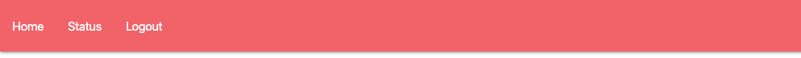
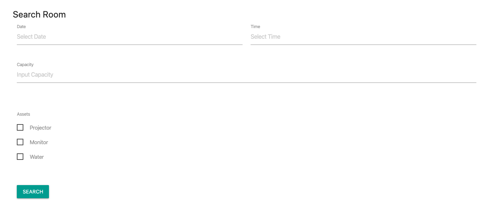

# Web Apps Project 5 // Room Booking Apps

## Projects Concepts

### Approaching a Project

Developing a large project is hard. Don't just dive in and try to tackle the entire thing all at once. As the famous saying goes:

A goal without a plan is just a wish.

Start with a plan! Here are some steps that I like to follow when building a project:

* outline the steps needed to build the project
* draw the application
  * what individual page would look like
  * how the page are connected to each other
* write down the pseudocode
* develop the page piece by piece

And just before submitting:

* squash all bugs
* check the rubric and make sure that your project meets all requirements

Take it slow and practice your newly acquired skills. You've got this! 🙌🏼

If you get stuck, take advantage of your mentorship services.

### Project Overview

In the _Room Booking Apps_ project, you'll create an app that allows you to view all conference/meeting room or by search filter and select rooms you want to book at certain date and time. The project emphasizes using every element you learn in this Degree.

#### Get the Project

You have a few options to start developing this project:

* forking and cloning the start repository
* starting from scratch with make your own file

#### Starter Code

If you'd like to work locally on your own computer, fork and clone the starter repository.

The code in the starter repo contains all the CSS and HTML markup that may be used but omits the Vue, Node code, and Database that is required to complete the project. This can save you some time if you don't wish to write all the CSS and HTML from scratch. The provided code will demonstrate a static HTML page of the finished application, but with no interactive functionality.

#### Starting from Scratch

If you'd like to start completely from scratch, you can make your own files you need.

#### Submission Requirements

Your submission should include all of the files necessary to launch your web application on a browser. You can assume that your reviewer will have browser installed on their machine.

#### Considerations

The focus of this project is on writing functional Vue and Node code, not on making the page beautiful. Feel free to spend some time working on your layout and CSS if you want to, but the goal for this project is correct functionality.

### Project Instructions & Rubric

#### How will this project be evaluated

Your project will be evaluated by a KODEgree Code Reviewer according to the rubric. Be sure to review it thoroughly before you submit. All criteria must "meet specifications" in order to pass.

The project rubric is your source of truth while building this project. Save it to your browser bookmarks so you can access it easily!

#### Submission Instructions

If you choose to develop on your local machine you will need to:

Push your project to GitHub, making sure to push the master branch. On the project submission page choose the option "Submit with GitHub" Select the repository for this project \(you may need to connect your GitHub account first\).

### User Story

**All Members**

**User Story \# 1** - In order to not have to enter my login details each visit, as a Staff Member, I want to have the application remember me.

**User Story \# 2 -** In order to see if there are available rooms on a specific date, as a Member, I want to be able to pick a date and see an overview of all available rooms and availability for that date.

**User Story \# 3 -** In order to find a room with a projector, as a Member, I want to be able to filter out rooms that don’t have a projector.

**User Story \# 4 -** In order to see all assets a room has, as a Staff Member, I want to view a list all the room's assets.

**User Story \# 5 -** In order to find out who has booked a specific room, as a Staff Member, I want to be able to see details about who the room was booked for.

**User Story \# 6 -** In order to view future room bookings, as a Staff Member, I want to be able to select a date using a calendar or search for a date.

**User Story \# 7 -** In order to find a room that has enough chairs, as a Staff Member, I want to be able to view room capacity.

**Admin**

**User Story \# 1 -** In order to create a new Admin User, as an Admin User, I want to be able to add and/or approve admin user accounts.

**User Story \# 2 -** In order to enable full access to the application, as an Admin User, I want to be able to add and/or approve full user accounts.

**User Story \# 3 -** In order to update the app with future company developments, as an Admin User, I want to be able to add buildings, floors, rooms and assets.

**Apps**

**User Story \# 1 -** My Room Booking should have login and register page for member.

**User Story \# 2 -** My Room Booking should have a navbar with an id of `navbar`. Contain link to homepage, booking status for member, and logout button.

**User Story \# 3 -** The navbar should always be at the top of the viewport.

**User Story \# 4 -** My Room Booking should have search form contain date and time, capacity, and assets.

**User Story \# 5 -** My Room Booking search result section should have a list of room using card deck with `class="card-deck"`.

**User Story \# 6 -** Each room displayed using card. Card Body should contain room name in `card-title` , room description and list of assets in `card-text`. In `card-footer` section should contain book button.

**User Story \# 7 -** My Room Booking should have a database named "H8\_Room\_Booking"

**User Story \# 8 -** "H8\_Room\_Booking" should have 3 tables. `users` tables for users data containing user\_id, username, password, and role. `rooms` tables for rooms data containing room\_id, name, description, capacity, and assets. `booking` tables for booking data containing user\_id, date and time, and room\_id.

**User Story \# 9 -** My Room Booking admin role can create, update, and delete rooms and rooms details.

**User Story \# 10 -** My Room Booking admin role can create, update, and delete users.

### Projects Submission

#### Instructions

Please verify that your project adheres to our HTML, CSS, JavaScript, and Git style guidelines.

If you chose to develop on your local machine you will need to:

* Push your project to GitHub, making sure to push the master branch.
* On the project submission page choose the option "Submit with GitHub"
* Select the repository for this project \(you may need to connect your GitHub account first\).

#### Project Submission Checklist

Before submitting your project, please review and confirm the following items.

* I am confident all rubric items have been met and my project will pass as submitted. \(If not, I will discuss with my mentor prior to submitting.\)
* Project builds correctly without errors and runs.
* All required functionality exists and my project behaves as expected per the project's specifications.

Once you have checked all these items, you are ready to submit!

### Project Rubric

| Application Setup |  |
| :--- | :--- |
| CRITERIA | SPECIFICATIONS |
| Is the application easy to install? | The application could be installed by executing npm install. |
| Does the application include README with clear installation and launch instructions? | An updated README that describes the project and has instructions for managing and modifying the project is included. |

| Main Page |  |
| :--- | :--- |
| CRITERIA | SPECIFICATIONS |
| Apakah main page mempunyai navbar? | Main page mempunyai navbar yang berisi link navigasi menuju home, booking, dan logout button. |
| Apakah main page mempunyai search form? | Main page mempunyai search form yang berisi date time, capacity, serta asset. |
| Apakah main page dapat menampilkan ruangan yang tersedia? | Main page dapat menampilkan ruangan yang tersedia berdasarkan hasil pencarian dari user. |

| Admin Page |  |
| :--- | :--- |
| Apakah admin dapat mengakses halaman admin? | Admin dapat mengakses ke halaman admin, dan user tidak dapat mengakses ke halaman admin. |
| Apakah admin dapat membuat ruangan baru? | Admin dapat membuat/menambahkan ruangan baru serta detail ruangannya. |
| Apakah admin dapat menghapus ruangan? | Admin dapat menghapus ruangan yang sudah ada. |
| Apakah admin dapat memperbarui ruangan yang ada? | Admin dapat memperbarui ruangan yang sudah ada. |
| Apakah admin dapat membuat user baru? | Admin dapat membuat/menambahkan user baru serta detail usernya. |
| Apakah admin dapat menghapus user? | Admin dapat menghapus user yang sudah ada. |
| Apakah admin dapat memperbarui user yang ada? | Admin dapat memperbarui user yang sudah ada. |

| Database |  |
| :--- | :--- |
| CRITERIA | SPECIFICATIONS |
| Apakah database dapat menyimpan data yang dibutuhkan? | Database dapat menyimpan data user, data ruangan, serta data booking. Masing-masing pada Table yang berbeda. |
| Apakah table user dapat menyimpan data yang dibutuhkan? | Table user dapat menyimpan data user\_id, username, password, serta role. |
| Apakah table room dapat menyimpan data yang dibutuhkan? | Table user dapat menyimpan data room\_id, name, description, capacity, serta asset. |
| Apakah table booking dapat menyimpan data yang dibutuhkan? | Table booking dapat menyimpan data user\_id, date dan time, serta room\_id. |

| Code Functionality |  |
| :--- | :--- |
| CRITERIA | SPECIFICATIONS |
| Apakah user dapat melakukan booking ruangan? | User dapat melakukan booking ruangan jika ada ruangan yang tersedia. Jika ruangan sudah dibooking pada waktu tertentu, user lain tidak dapat booking ruangan yang sama. |
| Apakah komunikasi REST API aman? | Setiap komunikasi endpoint menggunakan token yang diverifikasi. |
| Does the code run without errors? | The code runs without errors. There are no warnings that resulted from not following the best practices listed in the documentation. All code is functional and formatted properly. |

